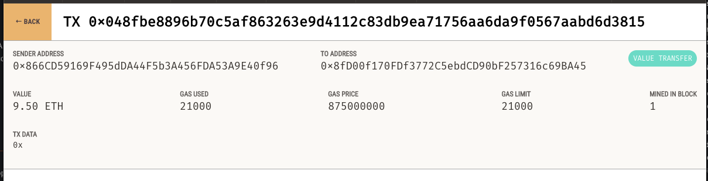

## Unit 19 Homework: Cryptocurrency Wallet

# Cryptocurrency Wallet

This is a Streamlit application that allows a customer to interact with their Ethereum account, and hire a fintech professional through the KryptoJobs2Go platform.

The application allows the customer to generate a new Ethereum account instance by using their mnemonic seed phrase, fetch and display the account balance associated with their Ethereum account address, calculate the total value of an Ethereum transaction, including the gas estimate, that pays a KryptoJobs2Go candidate for their work, digitally sign a transaction that pays a KryptoJobs2Go candidate, and send this transaction to the Ganache blockchain. Finally, the customer can review the transaction hash code associated with the validated blockchain transaction.

## Getting Started

To get started with this project, first, navigate to the project folder that contains the **`.env`** file, **`krypto_jobs.py`** and **`crypto_wallet.py`** files. Activate your Conda **`dev`** environment if it is not already active. Then, launch the Streamlit application by typing streamlit run krypto_jobs.py in your terminal.

## Requirements

To run this project, you need the following requirements:

- Python 3.8 or higher
- Streamlit
- Web3

You can install Streamlit and Web3 using the following command:

> pip install streamlit web3

## Project Structure

 - **'krypto_jobs.py'**: This is the main script file that contains the Streamlit application code for the KryptoJobs2Go platform. The application allows the customer to interact with their Ethereum account and hire a fintech professional.
- **'crypto_wallet.py'**: This script file contains the Ethereum transaction functions that have been incorporated into Python functions, allowing the automation of the process of accessing them.
- **'.env'**: Contains the mnemonic seed phrase for the Ethereum account.

## Usage

To use the KryptoJobs2Go application, follow the steps outlined below:

1. Launch the Streamlit application by typing streamlit run krypto_jobs.py in your terminal.

2. In the sidebar of the application, the your Ethereum account address and balance will be displayed.

3. Select a fintech professional from the dropdown menu and enter the number of hours you wish to hire them for.
4. The application will calculate the amount that the fintech professional will be paid in ether, and display it on the sidebar.

    

5. Click the "Send Transaction" button to sign, send the transaction with your Ethereum account information and generate a hash key.

6. If the transaction is successfully communicated to Ganache, validated, and added to a block, the resulting transaction hash code will be written to the Streamlit application sidebar.

    
7. Navigate to the Ganache accounts tab and locate your account (index 0).

8. Navigate to the Ganache transactions tab and locate the transaction.

